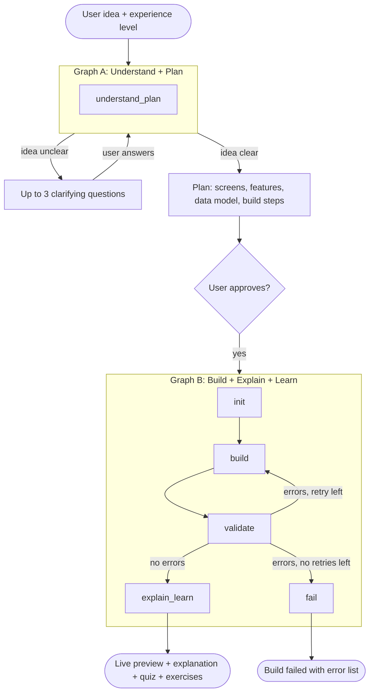

# AppMentor

**Describe an app idea. AppMentor plans it, builds it, explains it, and teaches you how it works.**

AppMentor is an AI mentor for people learning to build apps. You type an idea in plain English, review a short plan, and get a working mobile-style web app (HTML, CSS and vanilla JS) running in a live preview. You then get a guided lesson on the code that was just written, with a quiz and exercises.

```
Understand  ->  Plan  ->  Build  ->  Explain  ->  Learn
```

---

## Features

- **Understand**: reads your idea and asks up to 3 clarifying questions if it is vague.
- **Plan**: produces a compact plan with screens, features, data model and ordered build steps. You approve it before anything is built.
- **Build**: generates `index.html`, `style.css` and `app.js` for a 375x812 mobile-style app.
- **Self-checking builds**: every build is validated automatically. If it fails, the model gets the exact errors and fixes them.
- **Live preview**: each build is served from its own versioned preview URL.
- **Explain**: an architecture overview and a short explanation of every file.
- **Learn**: 4 key concepts, a 3-question quiz, 2 hands-on exercises and 3 next steps, adapted to your experience level (beginner, intermediate or advanced).
- **Fix loop**: if the preview throws an error, the error can be sent back to rebuild the app with minimal changes.
- **Versioned downloads**: every build is saved as `v1`, `v2`, ... and can be downloaded as a zip.
- **Sample app**: a ready-made habit tracker that works without any LLM call.

---

## How it works

AppMentor runs two LangGraph pipelines, with a human approval step between them.



### Graph A: Understand + Plan

One node, `understand_plan`.

1. Infers the app type, target users and core features (max 5) from your idea.
2. If the idea is unclear, it returns at most 3 clarifying questions and no plan.
3. If the idea is clear, or once you have answered the questions, it returns a plan. Your answers are treated as final, so it never asks twice.
4. The plan is normalised in code: at most 4 screens, 6 features and 6 build steps, and the tech stack is always `HTML, CSS, Vanilla JS`.

### Graph B: Build, Validate, Explain

| Node | What it does |
| --- | --- |
| `init` | Resets the retry counter and sets `status = "building"`. |
| `build` | Asks the model for the three files as JSON. On a retry it also receives the validation errors and the current files. |
| `validate` | Runs the checks below and records the errors. |
| `explain_learn` | Generates the architecture overview, per-file explanations, concepts, quiz, exercises and next steps. |
| `fail` | Sets `status = "failed"` after retries are used up. |

After `validate`, the graph takes one of three paths:

- no errors: go to `explain_learn`
- errors and a retry is left: go back to `build` (one extra attempt)
- errors and no retries left: go to `fail`

If `explain_learn` itself fails, the successful build is still returned, with an empty explanation and an `explanation_error` message.

### What `validate` checks

- all three files exist and are not empty
- `index.html` links `style.css` and loads `app.js` at the end of `<body>`
- 1 to 4 `<section>` screens
- no `sessionStorage`, `indexedDB`, cookies, `alert()`, `confirm()` or `prompt()`
- no `fetch`, XHR, WebSocket or dynamic `import()`
- no remote URLs, CDNs, `@import` or remote fonts
- balanced braces, and a real `node --check` syntax test when Node.js is installed
- every id that `app.js` looks up exists in `index.html`

These rules match what the sandboxed preview allows, so a build that passes validation will run there.

---

## Architecture

```
┌────────────────────┐        HTTP / JSON         ┌──────────────────────────────┐
│     Frontend       │ ─────────────────────────► │      Backend (FastAPI)       │
│  frontend/         │                            │  main.py     routes          │
│  index_1.html      │ ◄───────────────────────── │  graph.py    LangGraph + LLM │
│  (served on :5500) │   plan, files, lesson      └──────────────┬───────────────┘
└─────────┬──────────┘                                           │
          │ iframe                                               │ Gemini API
          ▼                                                      ▼
┌────────────────────┐                            ┌──────────────────────────────┐
│   Live preview     │ ◄───────────────────────── │  Generated files on disk     │
│ /preview/<id>/vN/  │                            │  ~/.appmentor/generated/     │
└────────────────────┘                            │    <session>/v1, v2, ...     │
                                                  │    <session>/latest.txt      │
                                                  └──────────────────────────────┘
```

**Storage.** Each session has its own folder with one subfolder per version (`v1`, `v2`, ...) and a `latest.txt` pointer. Only the three known filenames are ever written, so model output can never write outside the session folder. Old sessions are removed after 6 hours of inactivity. The folder lives outside the project on purpose, because `uvicorn --reload` and editor watchers would otherwise restart the server every time a build writes files.

### Tech stack

| Layer | Technology |
| --- | --- |
| LLM | Google Gemini through `langchain-google-genai` |
| Orchestration | LangGraph |
| Structured output | Pydantic with `PydanticOutputParser` |
| Backend | Python, FastAPI, Uvicorn |
| Frontend | Plain HTML, CSS and JavaScript |
| Generated apps | HTML, CSS, vanilla JS, `localStorage` |

---

## Project structure

```
appmentor/
├── backend/
│   ├── graph.py            # schemas, prompts, validation, storage, both LangGraph pipelines
│   ├── main.py             # FastAPI app and routes
│   ├── requirements.txt
│   └── .env.example
├── frontend/
│   └── index.html        # UI
├── .env                    # your local secrets (never committed)
├── .gitignore
└── Readme
```

---

## Getting started

### Prerequisites

- Python 3.10 or newer
- A Gemini API key from [Google AI Studio](https://aistudio.google.com/apikey)
- Node.js (optional, but recommended: it gives real JavaScript syntax checking during validation)

### 1. Install

```bash
cd backend
python -m venv .venv
source .venv/bin/activate        # Windows: .venv\Scripts\activate
pip install -r requirements.txt
```

### 2. Configure

```bash
cp .env.example .env
```

Open `.env` and set your key:

```env
GEMINI_API_KEY=your_key_here
```

| Variable | Required | Default | Purpose |
| --- | --- | --- | --- |
| `GEMINI_API_KEY` | yes | none | Gemini API key (`GOOGLE_API_KEY` also works). |
| `GEMINI_MODEL` | no | `gemini-3.6-flash` | Model name. Change it if your account uses a different one. |
| `GENERATED_DIR` | no | `~/.appmentor/generated` | Where builds are stored. |

### 3. Run the backend

```bash
uvicorn main:app --reload
```

The API starts on `http://127.0.0.1:8000`.

### 4. Open the frontend

Open `frontend/index_1.html` with a static server, for example the VS Code **Live Server** extension (port 5500). Make sure the API address in the frontend points at your backend.

---

## API overview

These routes appear in the server logs. See `backend/main.py` for the full list and request bodies.

| Route | Purpose |
| --- | --- |
| `POST /api/approve` | Approve the plan and run the build pipeline. |
| `POST /api/fix` | Send a preview error back to rebuild with minimal changes. |
| `GET /api/sample` | Return the built-in habit tracker, with no LLM call. |
| `GET /preview/{session}/{version}/{file}` | Serve a generated file for the live preview. |
| `GET /api/download/{session}?version=v1` | Download a build as a zip. |

---

## Rules for generated apps

Every generated app follows the same rules, so it runs safely in the preview:

- mobile layout for 375x812
- exactly three files: `index.html`, `style.css`, `app.js`
- no libraries, CDNs, remote images, fonts or API calls (mock data only)
- user data saved with `localStorage`, always inside `try/catch`
- no browser dialogs; inline inputs and on-page messages instead
- screens are `<section>` elements that `app.js` shows and hides, with a bottom tab bar or back buttons

---

## Troubleshooting

**`503 UNAVAILABLE ... high demand`**: this is Gemini being busy, not a bug in the app. The client retries automatically. If it keeps happening, wait a minute or switch `GEMINI_MODEL`.

**Every call fails right away**: check that `GEMINI_MODEL` is a model your account can use, and that `GEMINI_API_KEY` is set in `.env`.

**Build fails after retries**: the response includes the list of validation errors. Send the same idea again, or use the fix route to retry with those errors.

**Server keeps restarting while building**: keep `GENERATED_DIR` outside the project folder (the default) so file writes don't trigger `--reload`.

---

## Roadmap ideas

- Edit a plan before approving it
- Compare two versions side by side
- Export the lesson as a PDF
- Optional extra files (for example, separate JS modules) for advanced users

---

## Security

Never commit `.env`. It holds your API key, and the provided `.gitignore` already excludes it. If a key was ever pushed to a public repository, regenerate it.
